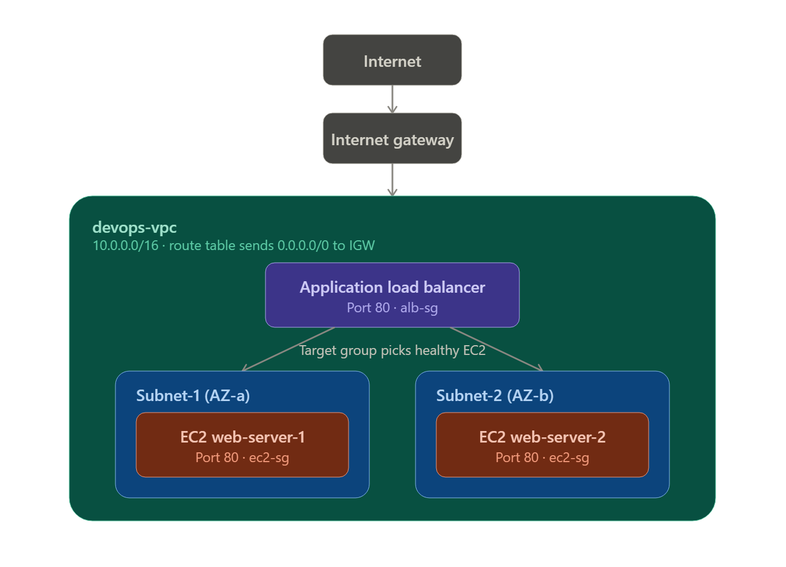
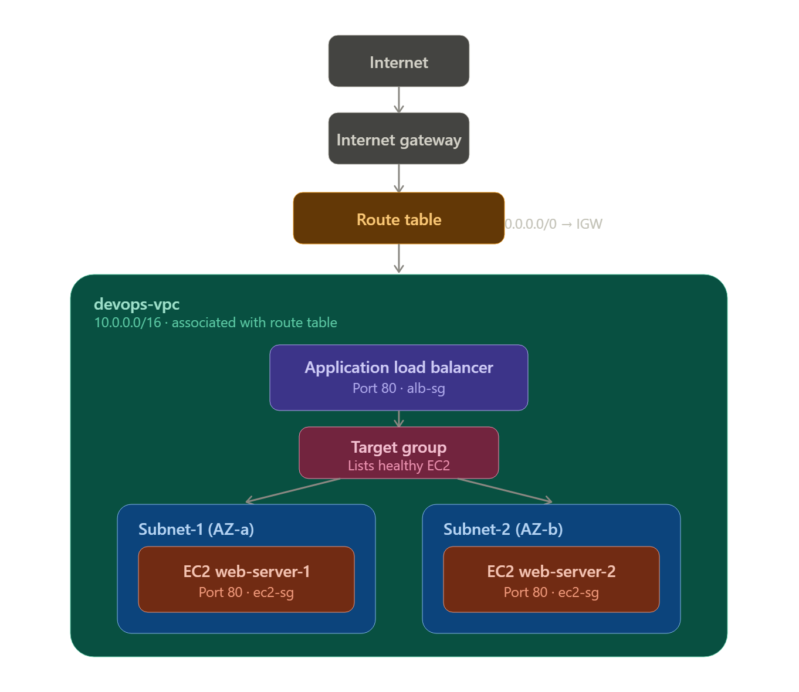

# 🔗 Kaun kisse aur kyu connected hai
> 1. Internet → IGW
- IGW ka kaam hai VPC ko internet se connect karna. Bina IGW ke, tumhara VPC bilkul private/isolated hota hai — bahar se koi access nahi kar sakta, andar se bhi koi internet pe nahi ja sakta. IGW = darwaza, restrict nahi karta, khol'ta hai.

> 2. IGW → VPC (Route Table ke through)
- IGW sirf attach hone se kaam nahi karta — Route Table ko batana padta hai "agar traffic ka destination 0.0.0.0/0 (yaani internet) hai, to IGW ki taraf bhejo." Ye Route Table hi actual traffic controller hai — subnet se associate karne se hi wo subnet "public" banta hai.

> 3. Route Table → Dono Subnets
- Ek hi Route Table dono subnets se associate hoti hai, taaki dono ko internet access mile equally.

> 4. ALB — VPC ke andar hi rehta hai, dono subnets me spread
- ALB tum dono subnets me launch karte ho (isliye Multi-AZ launch step tha) taaki agar ek poori AZ (data center) down ho jaye, ALB dusri AZ se kaam karta rahe.

> 5. ALB → Target Group → EC2
- Ye teen alag cheezein hai:
    - ALB = traffic receive karta hai bahar se
    - Target Group = ek list/directory hai jisme likha hai "ye  EC2 instances healthy hai" — ALB isi list ko dekh ke decide karta hai kaha bhejna hai
    - EC2 = actual server jo response deta hai

> 6. Security Groups — do alag firewalls, alag jagah lagte hai

- alb-sg ALB ke aage laga hai — decide karta hai kaun ALB tak pahunch sakta hai (yahan 0.0.0.0/0, matlab sabko allow)
- ec2-sg EC2 ke aage laga hai — decide karta hai kaun EC2 tak pahunch sakta hai. Yehi wo jagah hai jaha "koi aur access na kare" wali baat lagu hoti hai — IGW pe nahi, Security Group pe.

# 🧠 One-line summary
- IGW khol'ta hai internet ka darwaza → Route Table batati hai traffic kaha jaye → Security Groups decide karte hai kaun andar aa sakta hai → ALB traffic receive karke → Target Group ki list dekh ke → healthy EC2 ko forward karta hai.

# Doubt Questions:-
## Route Table — Network Level (IP ka rasta)
- Route Table sirf itna decide karti hai: "ye IP packet VPC ke andar rahega, ya bahar (internet) jayega?"

- Route Table ko ye bilkul nahi pata ki "EC2-1 healthy hai ya EC2-2", ya "kaunsa application chal raha hai". 
- Ye sirf IP address dekh ke rasta batati hai — jaise ek highway ka signboard jo bolta hai "seedha jao to city ke andar, right lo to highway (internet)".

## ALB — Application Level (kaunse specific server tak)
- ALB ka kaam bilkul alag hai: jab traffic VPC ke andar pahunch chuka hai (Route Table ka kaam khatam), tab ALB decide karta hai "in 2 EC2 servers me se kis specific server ko ye request forward karu" — based on health check, load balancing algorithm.

## 🧠 Analogy se samjho
> Socho tumhare college jaane ka rasta hai:
- Route Table = highway ka signboard jo bolta hai "Bhiwandi jaana hai to yaha se mudo" — sirf shehar tak pahuchne ka rasta batata hai
- ALB = college ke gate pe khada guard jo bolta hai "aaj Room 101 me lecture hai, Room 102 nahi" — specific destination decide karta hai jab tum already sahi shehar/building tak pahunch chuke ho

## 📊 Side-by-side
	              **Route Table**	                        **ALB**
1) Kaam	           - IP packet ko VPC ke andar          - Specific healthy EC2 choose karna.
                    ya bahar bhejna.
2) Level	       - Network layer (Layer 3)	        - Application layer (Layer 7)
3) Decision basis  - Sirf destination IP dekh ke	    - Health check, algorithm (round-robin)
4) Scope	       - Poori VPC	                        - Sirf apne Target Group ke andar
5) Agar ye na ho   - Traffic VPC se bahar/andar         - Traffic aa jayega VPC tak, 
                     hi nahi ja payega	                  lekin kisi specific EC2 tak nahi pahuchega

## 🎤 One-line jo yaad rakhna hai

Route Table batati hai "traffic VPC ke andar aaye ya bahar jaye" (rasta), ALB batata hai "VPC ke andar aane ke baad kis specific EC2 ko mile" (destination). Dono zaroori hai, lekin ek dusre ka kaam nahi karte.

================================================================
# Steps for making ALB
================================================================
# 1) pahale vpc create karna hai:-
    - vpc name --> devops-vpc
    - IPv4 CIDR manual input --> 10.0.0.0/16 --> 16 denge tu large private set milega
    - Now Click on create vpc

# 2) Internet Gateway (IGW) banao aur attach karo
- Internet Gateway banao aur VPC se attach karo. Bina isse, VPC ka kisi bhi resource ka internet se koi connection nahi ho sakta — chahe Route Table kuch bhi ho.

# 3. Route Table banao aur IGW route add karo (EC2 se PEHLE)
- Route Table banao, usme 0.0.0.0/0 → IGW ka route add karo, 
- fir usko dono subnets se associate karo. 
- Ye poora hone ke BAAD hi EC2 launch karna — warna User Data script (jo internet maangta hai) fail ho jayega.

# 4. Security Groups pehle se ready karo
- ec2-sg banao: Port 80 (HTTP) from 0.0.0.0/0, Port 22 (SSH) from My IP. 
- alb-sg banao: Port 80 from 0.0.0.0/0. Dono ALB launch karne se pehle taiyar rakho.

# 5. EC2 Instances launch karo (ab safe hai, kyunki routing ready hai)
- Ab EC2 launch karo dono subnets me. Agar User Data script use karna hai to Route Table already ready hone ki wajah se ye is baar fail nahi hoga.
- Ya phir manually SSH karke httpd install karo — dono valid hai.

# 6. Har EC2 ko INDIVIDUALLY test karo (ALB se pehle)
- Har EC2 ka Public IP browser me alag-alag test karo. 
- Jab tak dono individually 'Hello From Server X' na dikhaye, aage mat badho. Ye sabse important checkpoint hai.

# 7. Target Group banao aur EC2 register karo
- Target Group banao, health check path '/' rakho, EC2 instances register karo.
- Health status 'healthy' hone tak wait karo (1-2 min).

# 8. Application Load Balancer banao
- ALB banao, dono subnets select karo, alb-sg attach karo, listener HTTP:80 ko target group se forward karo.

# 🏗️ Har component ka real purpose

1) VPC ---> Tumhara apna private network AWS ke andar ---> e.g: Tumhare institute ki apni building

2) Subnet ---> VPC ke andar chhote sections AZ-wise split ---> e.g: Building ke alag alag floors

3) IGW ---> Internet se connection ka gateway ---> e.g: Building ka main gate

4) Route Table ---> "Traffic kaha jayega" ka rule book ---> e.g:- Building ka directory board

5) EC2 ---> Actual server jo website serve karta hai ---> e.g:- Teacher jo padhata hai

6) Security Group ---> Firewall — kaun andar aa sakta hai ---> eg:- Building ka security guard

7) Target Group ---> ALB ko batata hai kaun se EC2 healthy hai ---> Reception ki list ki "kaun se teacher available hai"

8) ALB ---> Traffic ko healthy EC2 me distribute karta hai ---> e.g:-Reception desk jo student ko sahi teacher ke paas bhejta hai