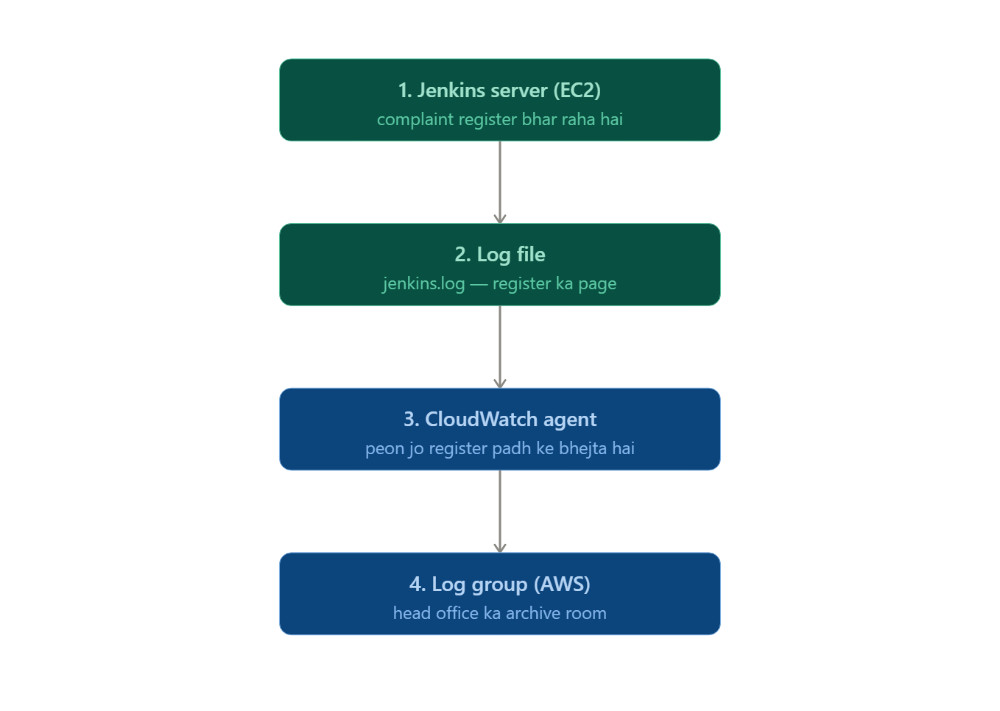
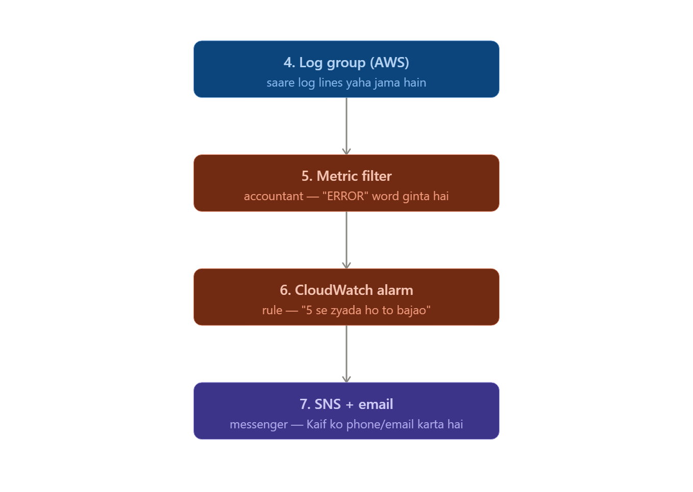

# 🔴 LEVEL 4 — Monitoring, Alerting aur user_data

- Goal: Ek "living" infrastructure banana jo khud logs bheje aur alert kare — jo tumne Jenkins project mein dekha, ab khud banao.

- Task 4.1 — CloudWatch Log Group banao aws_cloudwatch_log_group banao apne app ke liye, retention_in_days = 14 rakho. Socho: agar ye field na do to kya hoga?

- Task 4.2 — EC2 mein user_data likho (heredoc syntax se) Apne EC2 instance mein ek chhota bash script likho jo: nginx install kare, start kare, aur ek custom index.html file bana ke usme apna naam likh de. <<-EOF ... EOF syntax use karo.

- Task 4.3 — Metric Filter + Alarm banao aws_cloudwatch_log_metric_filter banao jo kisi specific word (jaise "FATAL") dhundhe logs mein, aur ek aws_cloudwatch_metric_alarm banao jo threshold cross hone pe trigger ho. Namespace aur metric_name dono jagah match karna zaroori hai — ye check khud karo.

- Task 4.4 — SNS Topic + Email Subscription banao Alarm ko SNS se connect karo apne email pe. Apply karne ke baad email confirm karna mat bhoolna — warna alert nahi aayega (ye common real-world mistake hai).

✅ Level 4 pass: Poore monitoring pipeline ka flow diagram khud bana ke explain kar sako (log → filter → metric → alarm → SNS → email) bina kisi cheat sheet ke.

# 🏫 Real-Life Analogy (Bright Education jaisa socho)

- Socho tumne ek naya branch khola — us branch mein ek complaint register hai jaha teachers roz likhte hain agar kuch problem ho ("Projector kharab", "AC nahi chal raha", wagera).

- Ab tumhe Bhiwandi office se baithe-baithe pata chalna chahiye agar branch mein kuch serious problem ho rahi hai baar-baar — bina roz register check karne jaye. 
- Isko hi hum automated monitoring kehte hain. 5 log isi kaam ko karte hain, ek chain mein:

## Part 1 — log kaise "safar" karti hai server se AWS tak:

1) Jenkins server apna kaam karte hue file mein likhta rehta hai (jaise teacher register mein likhta hai)
2) Wo file (jenkins.log) sirf ek text file hai — abhi tak AWS ko iske baare mein kuch pata nahi
3) CloudWatch Agent ek chhota background program hai jo har thodi der mein us file ko "padhta" hai — jaise peon roz register uthata hai
4) Agent jo padhta hai, wo AWS ke Log Group mein bhej deta hai — ye ek storage jagah hai jaha sab log lines collect hoti hain

# Ab dusra half dekho — log group mein pahunchne ke baad kya hota hai:

## Part 2 — logs se alert tak:

5) Metric Filter log group ke andar "ERROR" jaisa word dhundhta rehta hai aur counter rakhta hai — jaise ek accountant register padh ke ginti karta hai "kitni baar urgent likha gaya"
6) Alarm ek simple rule hai — "agar count 5 se zyada ho jaye 1 minute mein, to trigger ho jao"
7) SNS + Email — jaisi hi Alarm trigger hota hai, ye messenger tumhe (Kaif) email bhej deta hai

# 🔑 Sabse Important Baat Samjho
- Har step ka OUTPUT agle step ka INPUT hai — yehi "jude hue" hone ka matlab hai:

**Step**	        **Iska OUTPUT (jo agle ko chahiye)**
- Jenkins	          Ek file banata hai (jenkins.log).
- CloudWatch Agent	  Us file ko Log Group ka naam batata hai - jaha bhejna hai.
- Log Group	          Ek jagah/naam deta hai (/jenkins/logs) jise Metric Filter reference karega.
- Metric Filter	      Ek number banata hai (metric) jise Alarm check karega.
- Alarm	              Trigger hone pe SNS Topic ka ARN call karta hai.
- SNS	              Email bhej deta hai.

> EC2 create hote hi automatically kaunse commands chalane hain → woh user_data mein likhte hain.